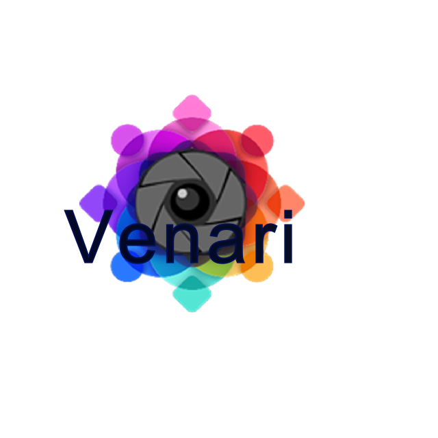

# Venari

Venari is a photo recognition and geo-location scavenger hunt. Once logged in users can submit their own challenges as well as participate in current challenges. Once the user completes a challenge a badge is added to their trophy room.

## Getting Started

```
npm install
```

### Prerequisites

What things you need to install the software and how to install them

```
node 8.8.1
```

### Installing

A step by step series of examples that tell you have to get a development env running

Say what the step will be

```
Give the example
```

And repeat

```
until finished
```

End with an example of getting some data out of the system or using it for a little demo

## Running the tests

Explain how to run the automated tests for this system

### Break down into end to end tests

Explain what these tests test and why

```
Give an example
```

### And coding style tests

Explain what these tests test and why

```
Give an example
```

## Deployment

Add additional notes about how to deploy this on a live system

## Built With

* [React](https://reactjs.org/docs) - The web framework used
* [NPM](https://docs.npmjs.com/) - Dependency Management
* [Webpack](https://webpack.js.org/concepts//) - Used to complile files

## Contributing

Please read [CONTRIBUTING.md](https://gist.github.com/PurpleBooth/b24679402957c63ec426) for details on our code of conduct, and the process for submitting pull requests to us.


## Authors

* **Nicole Creshon** - *Software Engineer* - [BlackAndWhiteRainbows](https://github.com/BlackAndWhiteRainbows)
* **Ryan Diaz** - *Product Owner* - [BlackAndWhiteRainbows](https://github.com/BlackAndWhiteRainbows)
* **Paul Soniat** - *Scrum Master* - [BlackAndWhiteRainbows](https://github.com/BlackAndWhiteRainbows)

See also the list of [contributors](https://github.com/your/project/contributors) who participated in this project.

## License

This project is licensed under the ISC License - see the [LICENSE.md](LICENSE.md) file for details

## Acknowledgments

* Operation Spark
